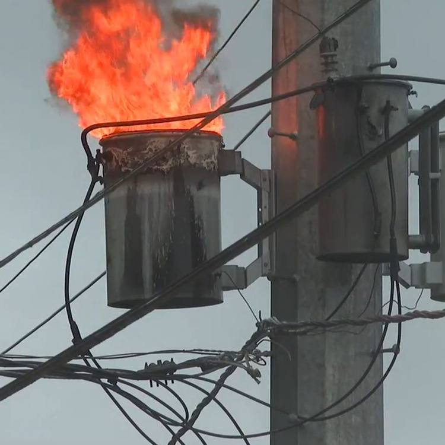
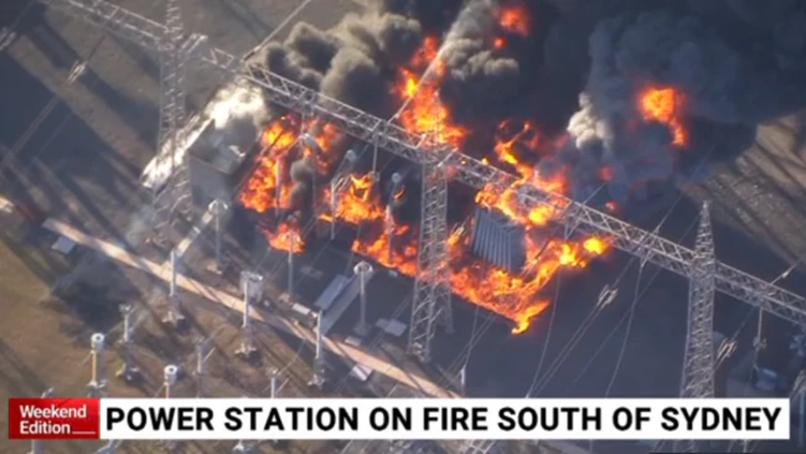
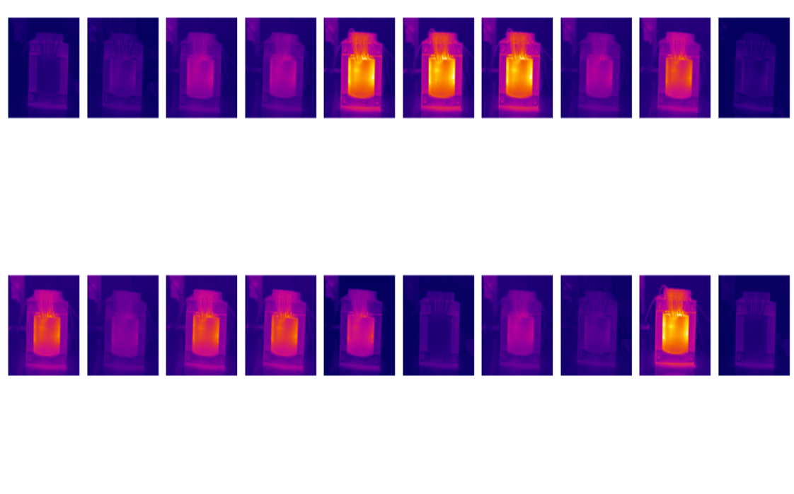
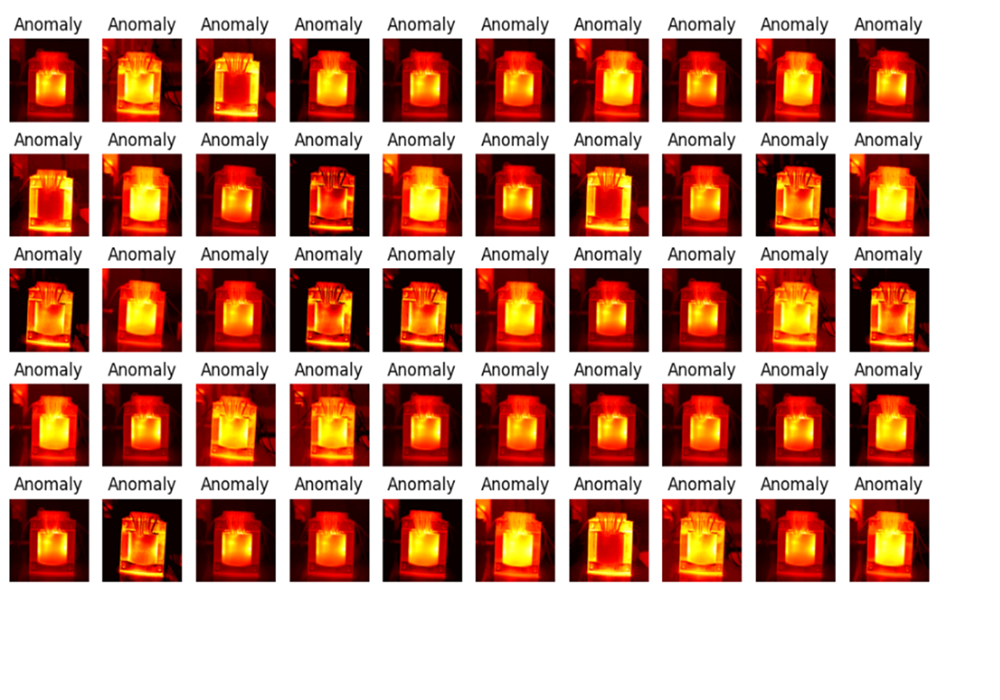

# Electrical-Transformers-Fault-prediction-and-Anomaly-Detection-using-Infrared-Images

#introduction
Transformers are essential components in power systems, used to increase or decrease voltage levels for various applications such as transmission, residential areas, and substations. The main components of transformers include insulators, cores, coils, and junctions. During operation, varying loads and conditions can lead to an increase in load and current, resulting in a rise in temperature. Elevated temperatures may cause short circuits and damage to the coil structure, and in severe cases, can lead to explosions and fires.
Therefore, preventive and predictive maintenance is crucial to ensure the stability and optimal condition of the power system, helping to prevent failures.
   
  

# Dataset Explaination 
This is thermal images (IRT) dataset in the context of condition monitoring of electrical equipment--Transformer. All artificially generated defects are internal faults.

The number of images is 255 in 9 conditions.
 

This is thermal images (IRT) dataset in the context of condition monitoring of electrical equipment--
Transformer. All artificial generated defects are internal faults and depend on neither external pieces
nor failure in initial setup components. Regarding the transformer, 8 different cases of short circuit
failures in common core winding were considered.The thermal image acquisition is done at the
workbench by a Dali-tech T4/T8 infrared thermal image camera at an Electrical Machines Laboratory
at the environment temperature of 23°.

# DATASET SOURCE

Najafi, Mohamad; Baleghi, Yasser; Mirimani, Seyyed Mehdi  (2021), “Thermal images dataset, Transformer, 1 phase  dry type”, Mendeley Data, V3, 
doi: 10.17632/8mg8mkc7k5.3
https://data.mendeley.com/datasets/8mg8mkc7k5/3

# MODEL ALLOCATION 
An autoencoder is a neural network that compresses input data into a lower-dimensional representation and then reconstructs it back to the original form. We used it to detect high-temperature anomalies by identifying images that the model struggles to accurately reconstruct, indicating unusual patterns.

Encoding
- Comprises three convolutional layers that progressively reduce the image size from 224×224 to 28×28 while increasing the number of feature maps (1→16→32→64).
- Each convolutional layer is followed by a ReLU activation for non-linearity which is very crucial for reconstruction of images.

Decoding
coder- Consists of three transposed convolutional layers that upsample the feature maps from 64×28×28 back to the original image size of 224×224 

# RESULTS 
As it is clear, the final decision of model detected anomalies perfectly with high accuracy , and also it will be possible to modify and change the intensity and level of Threshold in percent. In this case I  applied 75% 
So overall, after computing the reconstruction error the samples with more than threshold reconstruction error will consider anomaly. According to model, with 75% threshold, 64 samples detected as anomaly and they are be about to cause error and explosion.

